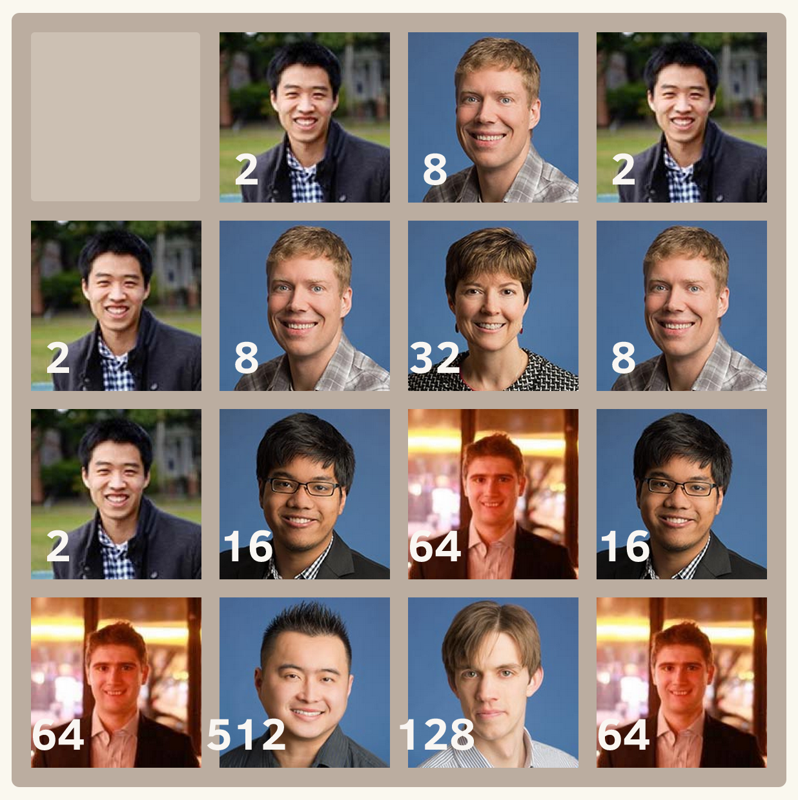

# 2048-kensho

[Play 2048-kensho](http://glebbahmutov.com/2048-kensho/)

Every page reload reshuffles the team numbers

To run the website locally: `npm start` then open the website

To push to the website: `npm run push`

## Small print

Author: Gleb Bahmutov &copy; 2014

* [@bahmutov](https://twitter.com/bahmutov)
* [glebbahmutov.com](http://glebbahmutov.com)
* [blog](http://bahmutov.calepin.co/)

License: MIT - do anything with the code, but don't blame me if it does not work.

Spread the word: tweet, star on github, etc.

Support: if you find any problems with this module, email / tweet /
[open issue](https://github.com/bahmutov/2048-kensho/issues) on Github
